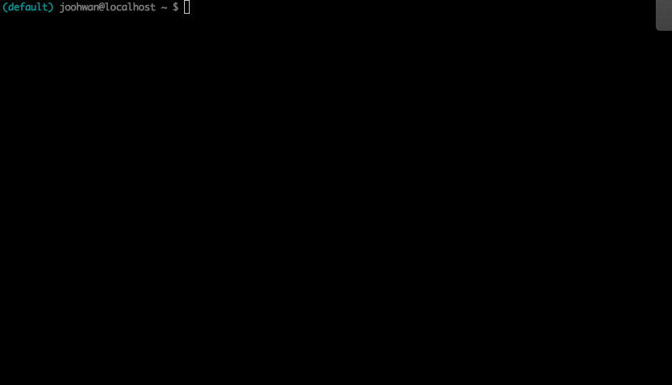

Features
========

**dtags** is a lightweight command line tool which lets you:

-  Tag and un-tag directories
-  Change directories quickly via tags
-  Execute commands in tagged directories at the same time
-  Easily manage multiple git repositories, vagrant machines etc.

All commands come with tab-completion.

Installation
============

**Step 1**: Check requirements:

-  Python 2.7+ or 3.4+
-  Recent version of `pip <https://pip.pypa.io>`__
-  Recent version of Bash, Zsh or Fish with tab-completion enabled

**Step 2**: Install the package:

.. code:: bash

    # You may need to sudo depending on your setup
    ~$ pip install --upgrade dtags

**Step 3**: Add the following line to your shell runtime configuration:

.. code:: bash

    # For zsh, place in ~/.zshrc:
    command -v dtags > /dev/null 2>&1 && eval "`dtags shell zsh`"

    # For bash, place in ~/.bashrc (or ~/.bash_profile for OS X):
    command -v dtags > /dev/null 2>&1 && eval "`dtags shell bash`"

    # For fish, place in ~/.config/fish/config.fish:
    command -v dtags > /dev/null 2>&1; and dtags shell fish | source

**Step 4**. Restart your shell.

::

    Note for those who are upgrading from v1.x.x:
    
      dtags v2 has config changes that are not backwards-compatible.
      If you want to keep your tags, you need to run a migration script:
      
       ~$ git clone https://github.com/joowani/dtags.git
       ~$ python dtags/scripts/migrate.py
       
      If you don't mind losing them, simply run 'rm -rf ~/.dtags' instead.

Once installed, you will have **5** commands at your disposal: ``tag``,
``untag``, ``d``, ``e`` and ``dtags``. Make sure you don't have any
linux aliases, functions or symlinks etc. with the same names.

Usage Examples
==============

Tag directories with ``tag``:

.. code:: bash

    ~$ tag ~/web dev work   # add tags 'dev' and 'work' to ~/web
    ~$ tag ~/app            # tag ~/app with its basename, 'app'

Un-tag directories with ``untag``:

.. code:: bash

    ~$ untag ~/web dev      # remove tag 'dev' from ~/web
    ~$ untag ~/app          # remove all tags from ~/app 

Change directories with ``d`` (designed to fully replace ``cd``!):

.. code:: bash

    ~$ d                    # go to the user's home directory 
    ~$ d frontend           # go to the directory tagged 'frontend'
    ~$ d tag_with_many_dirs # prompt the user to select a specific directory         
    ~$ d ~/app              # go to directory ~/app

Execute commands in one or more directories with ``e``:

.. code:: bash

    ~$ e repo git status    # execute 'git status' in directories tagged 'repo'
    ~$ e ~/vm vagrant halt  # execute 'vagrant halt' in directory ~/vm
    ~$ e -p vm git pull     # execute 'git pull' in directories tagged 'vm' in parallel
    ~$ e vm,~/foo ls        # execute 'ls' in directories tagged 'vm' and ~/foo

Search and manage tags with ``dtags``:

.. code:: bash

    ~$ dtags                # display the directories-to-tags mapping
    ~$ dtags list ~ ~/vm    # display the tags and directories associated with ~ and ~/app
    ~$ dtags list foo bar   # display the tags and directories associated with 'foo' or 'bar'
    ~$ dtags reverse        # display the tags-to-directories mapping
    ~$ dtags edit           # edit tags and directories via editor like vim
    ~$ dtags clean          # remove invalid or stale tags and directories

You can always use the ``--help`` option to find out more about each command!

Technical Notes
===============

-  Windows is currently not supported
-  The directory-to-tags mapping is saved in ``~/.dtags/mapping``
-  Tags are also saved on their own in ``~/.dtags/tags`` for
   tab-completion
-  ``e -p`` hangs on interactive commands that wait on input (no easy
   way around this)
-  ``e -p`` spawns child processes and redirects their output to
   temporary files and then to stdout
-  ``e -p`` sends *sigterm* to its child processes when killed
-  ``e`` uses environment variable **$SHELL** to guess which shell is in
   use
-  ``e`` redirects all stderr to stdout and should always return an exit
   status of 0
-  ``e`` executes the commands using *interactive shell*, which has pros
   and cons:

   -  ``e`` can properly use linux functions and aliases
   -  The shell runtime configuration must be "sourced" each time the
      command is run
   -  The performance of ``e`` is affected by the shell startup time
      (beware oh-my-zsh users)
   -  Any errors thrown during the "sourcing" will show up in the output
      of ``e``

-  ``dtags edit`` uses environment variable **$EDITOR**
-  ``d`` prefers tags over subdirectories if there is a name conflict
   -  To go to the subdirectory put a ``/`` after the directory name
-  ``d`` requires ``grep``, ``cut``, ``seq`` and ``/dev/null``
-  ``d`` expects ``~/.dtags/mapping`` to be correctly formatted:

   -  Please refrain from editing ``~/.dtags/mapping`` directly
   -  Instead, use ``dtags edit`` which does the validation and
      formatting for you

-  Tab-completion expects ``~/.dtags/tags`` to be correctly formatted:

   -  Don't touch this file at all if possible
   -  If this is deleted, it is auto-generated the next time a dtags
      command is run.
